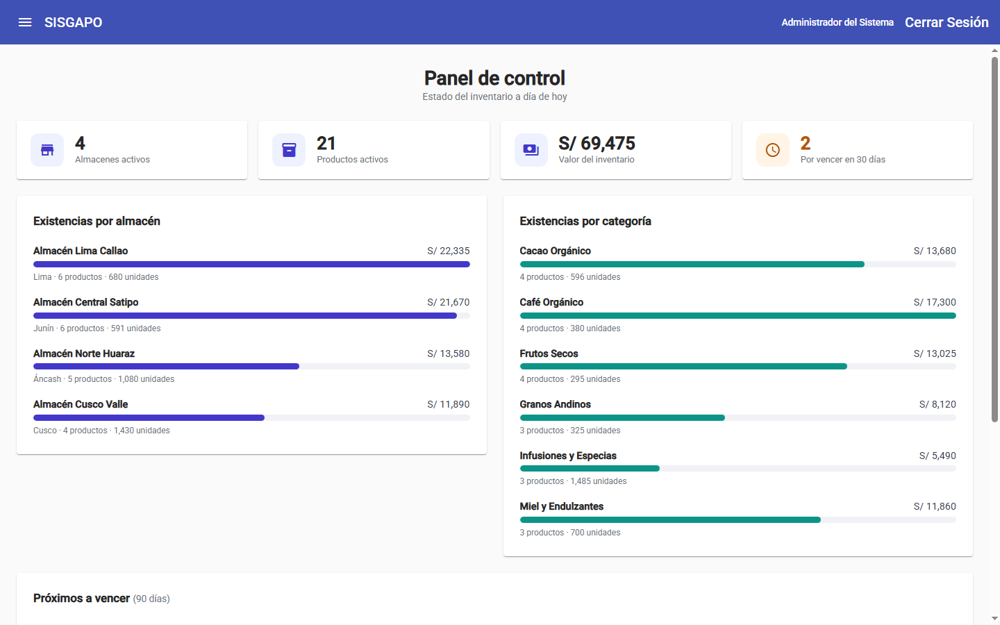
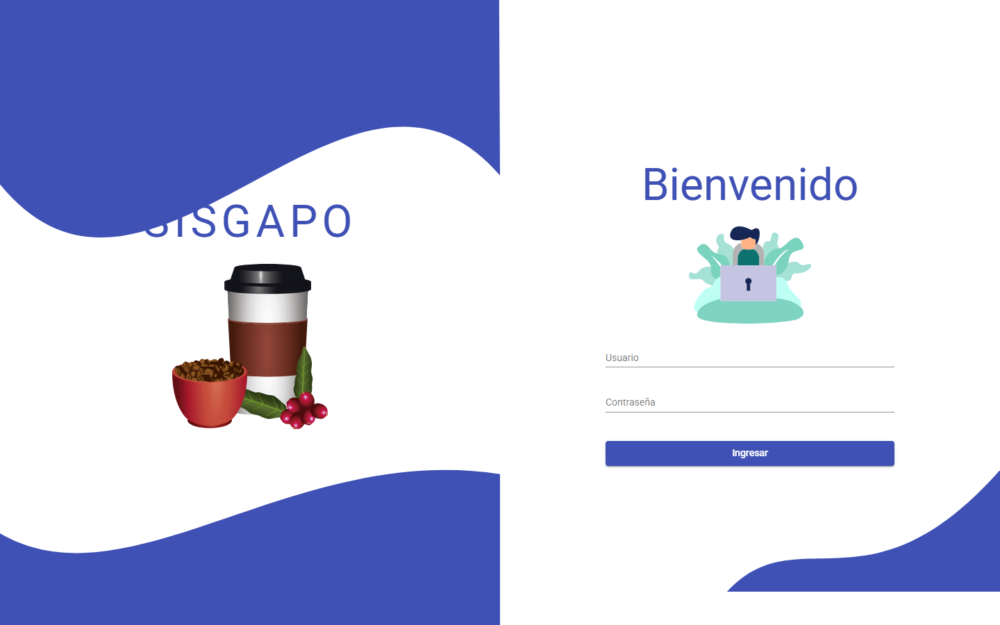
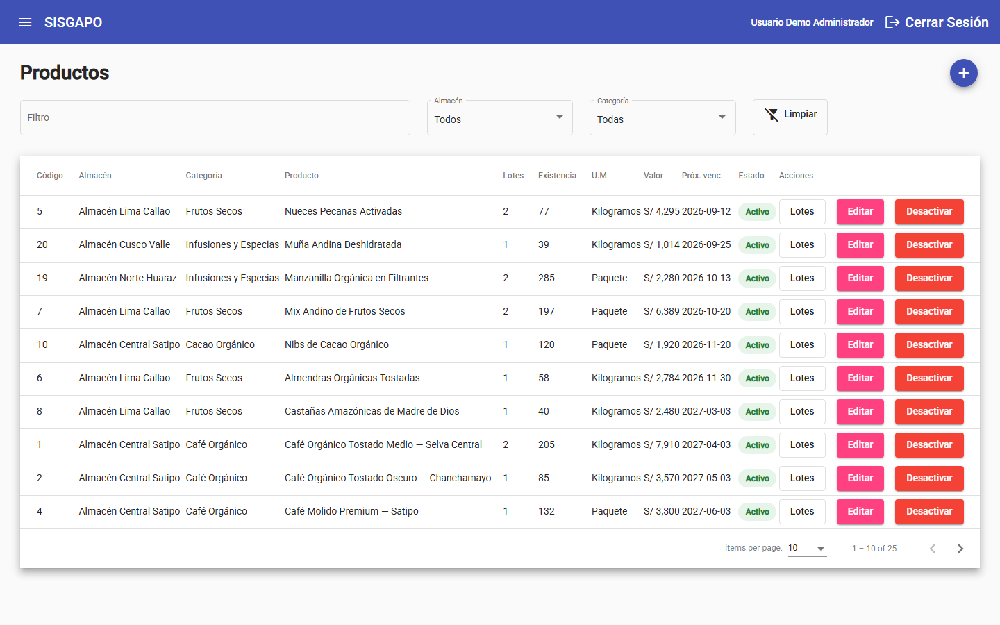

# SISGAPO

[](https://github.com/Jmurga16/sisgapo/actions/workflows/ci.yml)

Sistema de gestión de almacén de productos orgánicos. Multi-almacén, con categorías,
lotes y control de vencimientos.

Desarrollado en 2021 como proyecto universitario (UNMSM, Ing. de Sistemas) y recuperado
en 2026: documentado, auditado y reparado. La auditoría completa —37 hallazgos
priorizados— está en [`sisgapo-docs/06-hallazgos.md`](sisgapo-docs/06-hallazgos.md).

| Capa | Stack |
|---|---|
| Frontend | Angular 9 + Angular Material |
| Backend | ASP.NET Core 8 (API / Business / Data / Entity), JWT |
| Datos | SQL Server, lógica en stored procedures |

---

## Capturas

### Panel de control



| Acceso | Gestión de productos |
|---|---|
|  |  |

Las capturas usan los datos que crea `docker compose`: muestran el sistema ejecutándose
contra SQL Server, no una maqueta estática.

---

## Levantarlo en local

Requisitos: Docker Desktop, .NET SDK 8 o 9, y Node 18+.

### 1. Base de datos

```bash
docker compose up -d
```

Levanta SQL Server, crea `DB_SISGAPO` y carga esquema, procedimientos y datos de
demostración desde [`sisgapo-docs/sql/`](sisgapo-docs/sql/). Es reejecutable: volver a
lanzarlo deja la base en el estado inicial.

> Se publica en el puerto **14330**, no en el 1433, para no chocar con una instancia
> local de SQL Server. Cambia `MSSQL_SA_PASSWORD` copiando `.env.example` a `.env`.

### 2. API

```bash
cd sisgapo-api
dotnet run --project SISGAPO_API
```

En `https://localhost:44360`, con Swagger en `/swagger`. Swagger trae el botón
*Authorize*: pega ahí el token que devuelve `POST /LoginService` para probar el resto.

En local no hace falta configurar nada: `appsettings.Development.json` trae la cadena de
conexión del contenedor y una clave JWT de desarrollo. Las dos son públicas y no valen
fuera de tu máquina — ese es justamente el motivo por el que se pueden versionar.

**Fuera de `Development` no hay valores por defecto:** la API exige las variables de
entorno de la tabla de abajo y falla con un mensaje explícito si faltan.

### 3. Frontend

```bash
cd sisgapo-web
npm install --legacy-peer-deps
npm start
```

En `http://localhost:4200`. Los scripts de `package.json` ya incluyen
`NODE_OPTIONS=--openssl-legacy-provider`, obligatorio en Node 17+ porque Webpack 4 usa
MD4 y OpenSSL 3 no lo expone.

### Secretos

`appsettings.json` solo tiene marcadores de posición. Estos son los valores que hay que
dar por configuración —variables de entorno, `dotnet user-secrets` en local, o los
*secrets* del servicio donde se despliegue— en cualquier entorno que no sea `Development`:

| Variable | Para qué | Requisito |
|---|---|---|
| `SISGAPO_CONNECTION_STRING` | Cadena de conexión a SQL Server | Sin ella la API no responde a nada que toque datos |
| `SISGAPO_JWT_KEY` | Clave con la que se firman los tokens | Mínimo 32 caracteres (HMAC-SHA256 firma con 256 bits) |

Y estos dos, que no son secretos pero sí cambian por entorno:

| Clave de `appsettings.json` | Para qué | Por defecto |
|---|---|---|
| `Cors:OrigenesPermitidos` | Dominios del frontend autorizados | `http://localhost:4200` |
| `Jwt:MinutosVigencia` | Duración del token | `480` (8 h) |
| `Demo:SoloLectura` | Bloquea altas, ediciones y cambios de estado | `false` |

Cambiar `SISGAPO_JWT_KEY` invalida todas las sesiones abiertas, que es justo lo que se
quiere si alguna vez se filtra. Para generar una:

```bash
openssl rand -base64 48
```

En despliegue, `MSSQL_SA_PASSWORD` del `docker-compose.yml` deja de aplicar: ahí la base
la da el proveedor y su contraseña vive dentro de `SISGAPO_CONNECTION_STRING`.

Para una demo pública, activa el modo de consulta con la variable
`Demo__SoloLectura=true`. La API devolverá 403 ante cualquier escritura y el frontend
ocultará o deshabilitará esas acciones. En local queda desactivado para poder recorrer los
CRUD completos.

---

## Pruebas y CI

```bash
dotnet test sisgapo-api/SISGAPO_Back.sln --configuration Release
```

La suite unitaria cubre autenticación con bcrypt, usuarios inactivos, hashes corruptos,
validación de usuarios, modo demo y rechazo del delimitador legado.

Las pruebas de integración se ejecutan contra SQL Server y cubren las reglas de Lotes y
Movimientos —salida que deja el lote en negativo, ajuste sin diferencia, movimiento sin
motivo, baja de un lote con existencia, código de lote repetido, unidad homogénea entre
partidas— y el invariante del módulo: la existencia de un lote es siempre la suma de su
kardex. Necesitan la base cargada:

```bash
docker compose up -d
export SISGAPO_TEST_CONNECTION_STRING='Server=localhost,14330;Database=DB_SISGAPO;User ID=sa;Password=Sisgapo!Demo2026;TrustServerCertificate=True'
dotnet test sisgapo-api/Test/Test.csproj --configuration Release
```

Sin esa variable se omiten y el resto de la suite pasa igual.

El workflow de GitHub Actions tiene tres trabajos: compila la solución .NET y ejecuta las
unitarias, levanta SQL Server con `docker compose` para las de integración, y genera el build
de producción de Angular. Se ejecuta en cada push y pull request a `main`.

El workflow es únicamente CI: no publica la aplicación. El despliegue de la demo se realiza
manualmente después de comprobar que ambos jobs están en verde.

---

## Credenciales de demostración

| Usuario | Contraseña | Rol | Para probar |
|---|---|---|---|
| `demo.supervisor` | `SisgapoDemo2026!` | Supervisor | Altas, ediciones, cambios de estado y ajustes de inventario |
| `demo.asistente` | `SisgapoDemo2026!` | Asistente | Panel, consultas y registro de entradas y salidas |

El Supervisor gestiona almacenes, zonas, categorías, productos y lotes, pero no Usuarios. El
Asistente registra movimientos de inventario pero no puede ajustar existencias ni mantener
lotes, así que sirve para comprobar que menús y escrituras cambian según el rol.

> Las contraseñas se guardan con bcrypt. La contraseña compartida y documentada es una
> licencia de la demo, no del diseño: en el original de 2021 estaban en texto plano
> (`06-hallazgos.md`, S-02).
> En una demo pública interactiva, programa el reinicio periódico de los datos. Usa
> `Demo__SoloLectura=true` como alternativa temporal si el reinicio no está disponible.

Al crear usuarios nuevos se exige una contraseña inicial de al menos 8 caracteres. Editar
los datos de una persona no cambia su contraseña. No se incluye recuperación porque la demo
no tendrá cuentas reales.

---

## Documentación

Empieza por [`sisgapo-docs/README.md`](sisgapo-docs/README.md).

| Documento | Para qué |
|---|---|
| `01-analisis-general.md` | Qué hace el sistema y en qué estado está |
| `02-arquitectura.md` | Capas y flujo de un request |
| `03-modelo-de-datos.md` | Tablas, relaciones y procedimientos |
| `04-api-referencia.md` | Endpoints y catálogo de `sOpcion` |
| `05-frontend.md` | Módulos, rutas y servicios de Angular |
| `06-hallazgos.md` | **Auditoría: bugs, deuda técnica y seguridad** |
| `07-migracion-tier-free.md` | Plan de despliegue a coste US$ 0 |
| `08-plan-demo.md` | Cómo presentarlo |
| `09-mejoras-propuestas.md` | Roadmap |
| `10-decisiones.md` | Decisiones tomadas y alternativas descartadas |
| `11-estado-portafolio.md` | Estado hecho/pendiente y revisión de suficiencia funcional |
