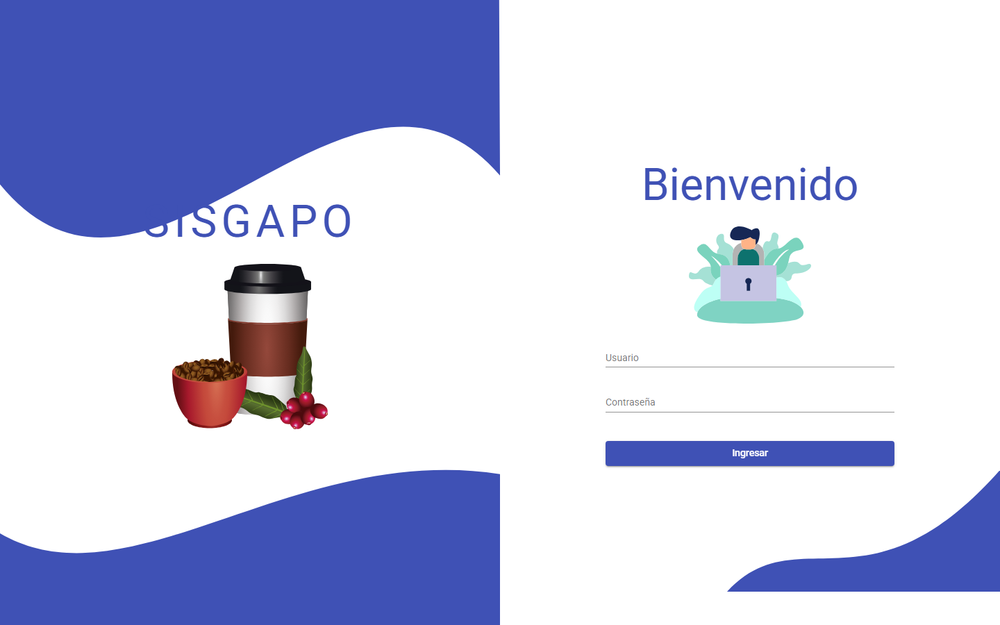
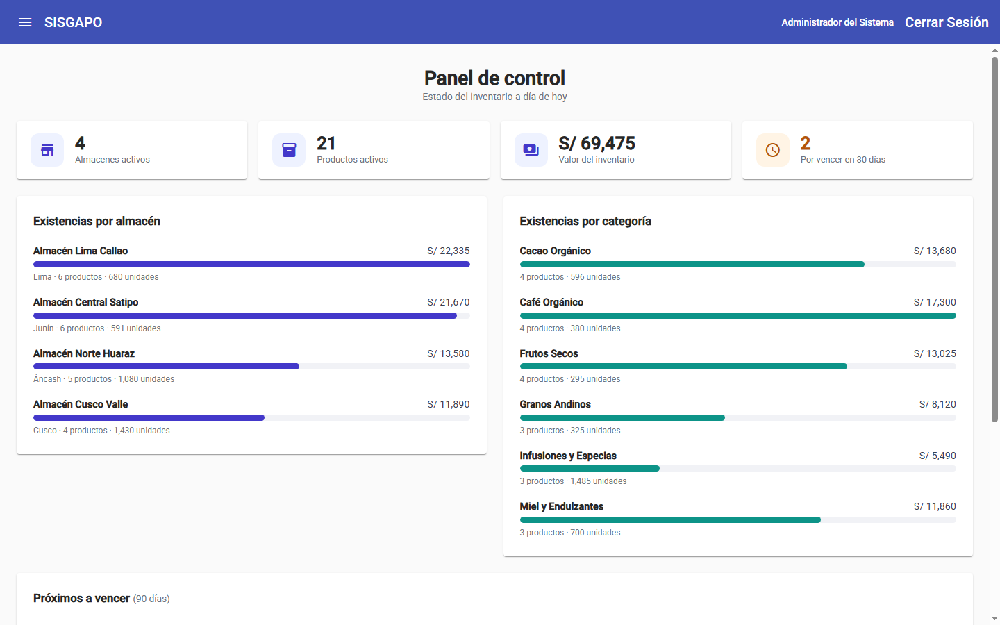
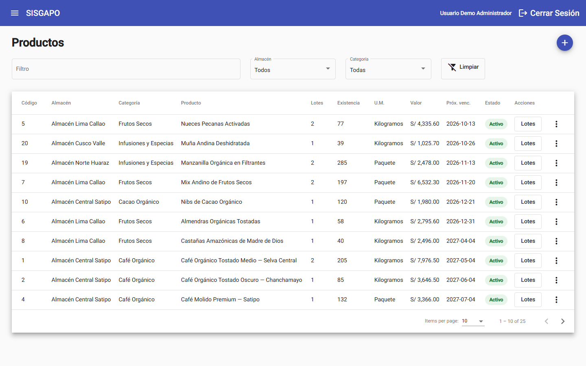
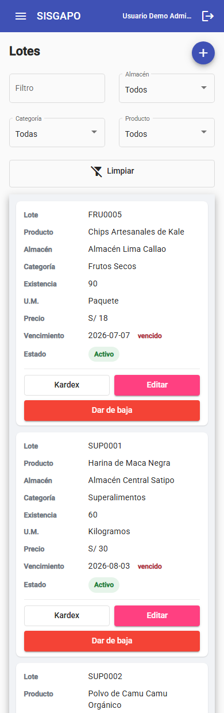
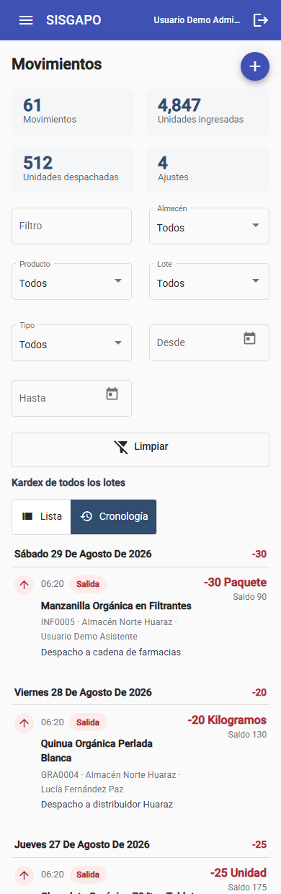

# 10 — Manual de usuario

Cómo se usa SISGAPO, pantalla por pantalla y en el orden en que se recorre. Está escrito para
quien entra a la demo pública, `https://sisgapo.devkora.com`, o a una copia local levantada
con el [README de la raíz](../README.md). Cómo está construido por dentro lo cuentan los
demás documentos.

## 1. Antes de empezar

Es una demo con datos de prueba. Se puede crear, editar, dar de baja y mover inventario sin
miedo: **cada noche, de madrugada, los datos vuelven a su estado inicial**, y lo mismo
pasa cada vez que se despliega una versión nueva. La recarga es a las 03:00 de Lima, o a las
04:00 de finales de octubre a finales de marzo, por el horario de invierno del servidor.

Hay tres cuentas, una por rol, con la misma contraseña:

| Usuario | Contraseña | Rol |
|---|---|---|
| `demo.admin` | `SisgapoDemo2026!` | Administrador |
| `demo.supervisor` | `SisgapoDemo2026!` | Supervisor |
| `demo.asistente` | `SisgapoDemo2026!` | Asistente |

Funciona en el navegador de un ordenador y en el de un teléfono. En pantallas estrechas el
menú se abre con el botón ☰ de la barra superior y los listados se leen como tarjetas en
lugar de tablas (sección 11).

## 2. Qué puede hacer cada rol

| Pantalla | Administrador | Supervisor | Asistente |
|---|---|---|---|
| Inicio (panel de control) | consulta | consulta | consulta |
| Usuarios | mantiene | — | — |
| Almacenes | mantiene | mantiene | — |
| Zonas | mantiene | consulta | — |
| Categorías, Productos y Lotes | mantiene | mantiene | consulta |
| Movimientos: entradas y salidas | registra | registra | registra |
| Movimientos: ajustes | registra | registra | — |

«Mantiene» quiere decir dar de alta, editar y activar o desactivar. El menú lateral solo
muestra las pantallas del rol, y la API vuelve a comprobar el permiso aunque alguien llegue
a una acción por otra vía: ocultar el botón no es la única barrera.

Ninguna baja borra datos. Desactivar un registro lo saca de los listados activos, de los
desplegables y del panel, pero queda en la base con su historia y se puede volver a activar.

## 3. Acceso

Hay dos formas de entrar:

- **Con un clic.** Debajo de *Entrar a la demo como* hay un botón por rol. Al pasar el ratón
  por encima se ve qué puede hacer cada uno. *Ver usuarios y contraseña* abre la tabla de
  cuentas.
- **Con usuario y contraseña**, como en un sistema real, y el botón *Ingresar*.

La sesión dura ocho horas. *Cerrar Sesión*, arriba a la derecha, la termina antes. Si la
sesión caduca mientras se trabaja, la siguiente acción devuelve a esta pantalla.

Tras cinco intentos fallidos en un minuto desde la misma conexión, la aplicación responde
*Demasiados intentos* y hay que esperar un minuto. El bloqueo afecta a esa conexión, no a la
cuenta ni a las demás personas.

## 4. Inicio: el panel de control

Es la primera pantalla después de entrar, para los tres roles. Arriba, cuatro indicadores:
almacenes activos, productos activos, valor del inventario en soles y lotes que vencen en los
próximos 30 días. Debajo:

- **Existencias por almacén** y **por categoría**: valor, número de productos y unidades de
  cada uno.
- **Próximos a vencer (90 días)**: los lotes con existencia que vencen pronto, con el
  almacén, la cantidad y los días que les quedan.

El panel solo cuenta lo activo: un producto, un almacén o una categoría dados de baja dejan
de sumar.

## 5. Usuarios

*Solo Administrador.*

El listado se filtra por nombre, rol y estado; *Limpiar* quita los filtros. Cada fila tiene
*Editar* y *Desactivar* o *Activar*.

**Alta.** *Agregar usuario* abre el formulario. Todos los campos son obligatorios y la
aplicación los valida antes de guardar:

- **Documento.** El DNI lleva 8 dígitos; el carnet de extranjería y el pasaporte, entre 6 y 15
  letras o números. No puede haber dos personas con el mismo tipo y número de documento.
- **Teléfono.** Nueve dígitos que empiezan por 9, con o sin el prefijo `+51`.
- **Fecha de nacimiento.** La persona tiene que ser mayor de edad.
- **Contraseña inicial.** Ocho caracteres como mínimo.

**El nombre de usuario no se escribe: lo genera el sistema** con el primer nombre y el primer
apellido, en minúsculas y separados por un punto (`maria.ramirez`). Si ya existe, le añade
un número (`maria.ramirez2`). El mensaje de confirmación lo muestra, y también aparece en la
columna *Usuario* del listado.

**Edición.** Cambia los datos de la persona y su rol, pero no la contraseña: el campo solo
aparece en el alta. La demo no incluye recuperación de contraseñas porque no tiene cuentas
reales.

**Desactivar.** Un usuario inactivo no puede iniciar sesión. Si era supervisor, deja de
aparecer en la lista de supervisores al dar de alta o editar un almacén.

## 6. Zonas

*Mantiene el Administrador; el Supervisor solo consulta.*

Las zonas son las regiones donde están los almacenes; se muestran como tarjetas con su
imagen. *Agregar zona* pide un nombre y la ruta de una imagen. No puede haber dos zonas con
el mismo nombre, y **una zona con almacenes activos no se puede dar de baja**: primero hay que
desactivar o mover esos almacenes.

## 7. Almacenes

*Administrador y Supervisor.*

El listado muestra código, zona, nombre y estado, con un filtro de texto. *Agregar almacén*
pide nombre, dirección, zona y supervisor. Las reglas:

- **El supervisor tiene que ser un usuario activo con rol de Supervisor.** La lista solo
  ofrece esos usuarios.
- **El nombre no se repite**, sin distinguir mayúsculas.
- **Un almacén con productos activos no se puede desactivar**, porque esos productos
  quedarían en un almacén que el panel ya no cuenta.
- **Un almacén no se puede activar si su zona está dada de baja.**

## 8. Categorías

*Mantienen Administrador y Supervisor; el Asistente consulta.*

Se buscan por nombre o descripción. *Agregar categoría* pide nombre —hasta 100 caracteres— y
descripción —hasta 250—. El nombre no se repite, y **una categoría con productos activos no se
puede desactivar**.

## 9. Productos

*Mantienen Administrador y Supervisor; el Asistente consulta.*

Es el catálogo. Se filtra por texto, almacén y categoría. Cada fila resume las partidas del
producto: cuántos lotes tiene, la existencia total con su unidad de medida, el valor y el
vencimiento más próximo. El botón **Lotes** de cada fila lleva a sus partidas (sección 10);
*Editar* y *Desactivar* están en el menú ⋮ de la fila.

**Alta.** *Agregar producto* pide nombre, almacén, categoría y los datos de la primera
partida: cantidad, unidad de medida, precio por unidad y fechas de fabricación y
vencimiento. Esa primera partida se crea con el producto, y la cantidad entra en su kardex
como una entrada más.

**Edición.** Solo cambia nombre, almacén y categoría. La existencia, el precio, las fechas y
la descripción son de cada lote y se mantienen desde Lotes; la existencia, además, solo
cambia con movimientos.

**Dar de baja.** **Un producto con existencia no se puede desactivar:** la aplicación dice
cuánto le queda y pide registrar la salida antes.

## 10. Lotes

*Mantienen Administrador y Supervisor; el Asistente consulta.*

Un lote es una partida concreta de un producto, con su propio código, precio y vencimiento:
el mismo café puede tener dos lotes que vencen en meses distintos. Se llega desde el menú
*Inventario → Lotes* o desde el botón *Lotes* de un producto, que deja el filtro puesto.

El listado se filtra por texto, almacén, categoría y producto. Cada fila tiene **Kardex**,
que abre la historia de ese lote en Movimientos, y el menú ⋮ con *Editar* y *Dar de baja* o
*Activar*. En un teléfono esas acciones salen como botones al pie de cada tarjeta.

**Alta.** *Agregar lote* pide el producto —se busca escribiendo su nombre o el del almacén—,
el código, la cantidad inicial, la unidad de medida, el precio y las fechas.

- Si el **código** se deja vacío, el sistema lo genera con las tres primeras letras del
  producto y un correlativo (`CAF0003`). Si se escribe, no puede repetir el de otro lote.
- **Todos los lotes de un producto comparten unidad de medida.** Si el producto ya se lleva
  en kilos, un lote nuevo no puede ir en paquetes: la existencia total sumaría cosas
  distintas.
- El vencimiento tiene que ser posterior a la fabricación.
- La cantidad inicial entra en el kardex como una entrada.

**Edición.** Cambia el código, la unidad, el precio, las fechas y la descripción, **pero no la
existencia**. Para corregirla está el ajuste de Movimientos, que deja constancia de quién lo
hizo y por qué.

**Dar de baja.** Solo un lote sin existencia. Si le queda mercadería, primero se registra la
salida.

## 11. Movimientos y kardex

*Los tres roles registran entradas y salidas; el ajuste es de Administrador y Supervisor.*

Aquí está la existencia de verdad: **el stock no se edita, se mueve**. Cada entrada, salida o
ajuste queda registrado con fecha, cantidad, saldo resultante, motivo y quién lo hizo.

Arriba, tres totales de lo que esté filtrado: unidades ingresadas, unidades despachadas y
número de ajustes. Los filtros son texto, almacén, producto, lote, tipo y un rango de fechas
*Desde* / *Hasta*. Hay dos formas de verlo:

- **Lista**: la tabla completa, paginada y ordenable por columna.
- **Cronología**: los movimientos agrupados por día, de lo más reciente a lo más antiguo,
  con *Mostrar más días* al final. Es la vista cómoda en un teléfono.

| Lotes en un teléfono | Kardex en un teléfono |
|---|---|
|  |  |

**Registrar un movimiento.** *Registrar movimiento* pide el lote —se busca por lote, producto
o almacén— y enseña su producto, almacén, existencia actual y vencimiento. Luego el tipo, la
cantidad y el motivo; antes de guardar, la ventana muestra la **existencia resultante**.

| Tipo | Qué se escribe | Qué hace |
|---|---|---|
| Entrada | La cantidad que llega | Suma al lote |
| Salida | La cantidad que sale | Resta; no puede sacar más de lo que hay |
| Ajuste | La **cantidad contada** en el inventario físico | El sistema calcula la diferencia y la registra como entrada o salida |

El motivo es obligatorio —una guía, una orden de despacho, un conteo— porque es lo que
explica el movimiento cuando alguien revisa el kardex. Un lote dado de baja no admite
movimientos, y si la cantidad contada coincide con la existencia no hay ajuste que registrar.

El movimiento queda firmado con el usuario de la sesión, no con un nombre que se pueda
escribir en el formulario.

## 12. Mensajes que puede devolver la aplicación

Cuando la aplicación rechaza algo, lo dice con un mensaje. Los más habituales:

| Mensaje | Qué pasa y qué hacer |
|---|---|
| *Ya existe un usuario con ese documento* | Otra persona tiene ese tipo y número de documento |
| *El supervisor debe ser un usuario activo con rol de supervisor* | Elige un supervisor de la lista; si falta, revisa su rol y su estado en Usuarios |
| *Ya existe un almacén con ese nombre* (o *zona*, o *Categoría ya registrada*) | El nombre está en uso, aunque sea con otras mayúsculas |
| *No se puede desactivar: el almacén tiene productos activos* | Da de baja o mueve antes esos productos. Zonas y categorías tienen su equivalente |
| *El producto tiene N en existencia…* / *El lote todavía tiene N en existencia…* | Registra la salida de esa mercadería antes de dar de baja |
| *La unidad de medida debe coincidir con los demás lotes del producto* | Usa la misma unidad que los lotes que ya tiene |
| *El lote solo tiene N en existencia* | La salida pide más de lo que hay |
| *La cantidad debe ser un número entero.* | Las cantidades se registran en unidades enteras de la U.M. del producto; el sistema no admite fracciones |
| *La cantidad contada coincide con la existencia: no hay ajuste que registrar* | El conteo cuadra; no hace falta ajuste |
| *Demasiados intentos* | Cinco intentos de acceso fallidos en un minuto: espera un minuto |
| *No se pudieron cargar…* con el botón *Reintentar* | La API no respondió; *Reintentar* vuelve a pedir los datos |
| *Ocurrió un error al procesar la solicitud.* | Un fallo inesperado del servidor. Queda registrado; vuelve a intentarlo y, si se repite, recarga la página |
| Barra *Demo pública en modo consulta* | La demo está en solo lectura: se puede recorrer todo, pero las altas, ediciones y cambios de estado están deshabilitados |

Los datos que cree o cambie una prueba no hace falta limpiarlos: vuelven a su estado inicial
esa misma madrugada.
